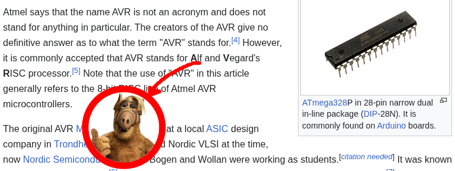

alfvcd is a wrapper around [simavr](https://github.com/buserror/simavr) that generates a .vcd file to visualize GPIO signals in GTKWave.

Requires simavr (libsimavr.a) in ~/simavr/simavr. Build with: make

Basic usage with a .hex file (requires --mcu and optionally --freq):
  ./alfvcd -m atmega328p -f 16000000 -o trace.vcd firmware.hex

Run until the firmware enters sleep/halt (recommended if the firmware terminates on its own):
  ./alfvcd -m atmega328p --indefinite -o trace.vcd firmware.hex

Run for a fixed amount of time (in microseconds, default 1000000 = 1 second):
  ./alfvcd -m atmega328p -t 500000 -o trace.vcd firmware.hex

Show which signals were recorded (ports B, C, D and all their pins):
  ./alfvcd -m atmega328p --indefinite -v -o trace.vcd firmware.hex

Open the result in GTKWave:
  gtkwave trace.vcd

Full options:
  -m, --mcu <name>      MCU (e.g: atmega328p, atmega168, attiny85)
  -f, --freq <hz>       Clock frequency (default: 16000000)
  -o, --output <file>   Output VCD file (default: trace.vcd)
  -t, --time <usec>     Simulation time in microseconds (default: 1000000)
      --indefinite      Run until the firmware enters sleep/halt
  -v, --verbose         Show recorded ports and signals
  -h, --help            Show help

Run tests:
  make test
